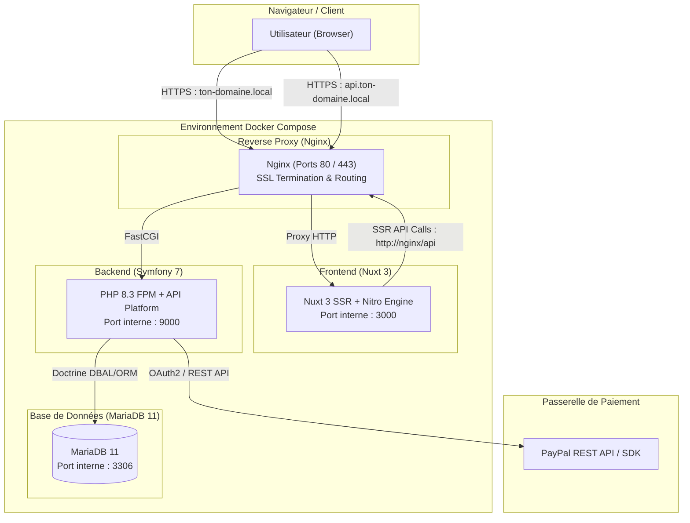
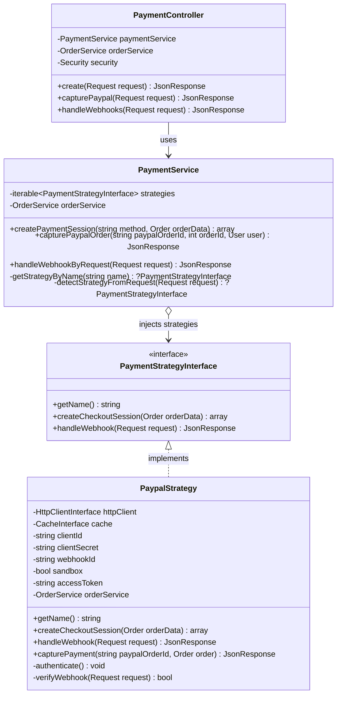
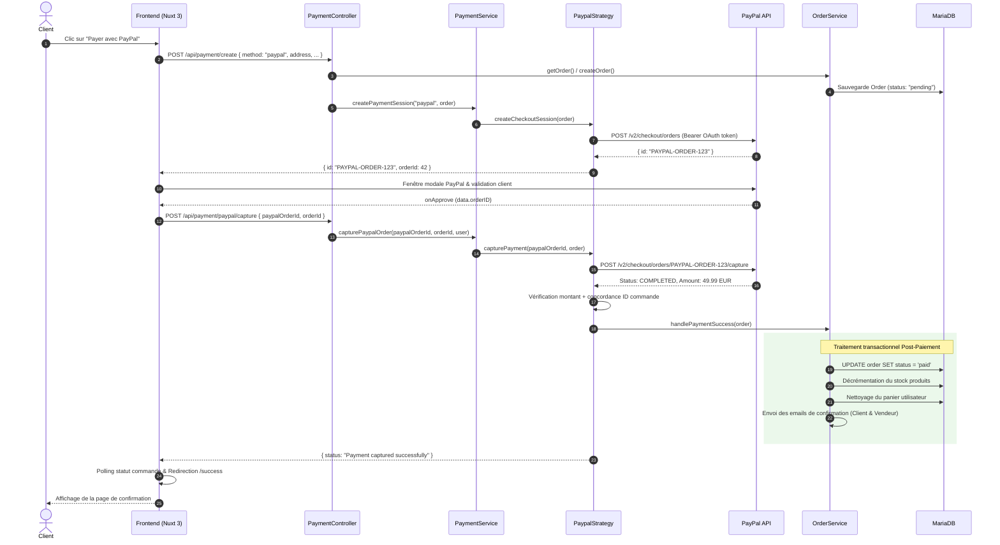

# 🛍️ Monorepo E-Commerce & Système de Paiement Modulaire

Bienvenue sur le projet d'application e-commerce moderne architecturée en monorepo, intégrant un système de paiement extensible basé sur le patron de conception **Strategy (Design Pattern)** avec **PayPal**.

---

## 📑 Sommaire

- [1. Vue d'Ensemble & Architecture Globale](#1-vue-densemble--architecture-globale)
- [2. Stack Technique & Structure du Monorepo](#2-stack-technique--structure-du-monorepo)
- [3. Système de Paiement & Design Pattern Strategy](#3-système-de-paiement--design-pattern-strategy)
  - [Pourquoi le Strategy Pattern ?](#pourquoi-le-strategy-pattern-)
  - [Modélisation & Diagramme de Classes](#modélisation--diagramme-de-classes)
  - [Flux d'Exécution & Diagramme de Séquence](#flux-dexécution--diagramme-de-séquence)
  - [Implémentation de la Stratégie PayPal](#implémentation-de-la-stratégie-paypal)
  - [Traitement Post-Paiement (OrderService)](#traitement-post-paiement-orderservice)
- [4. Réseau, Proxy Nginx & Sécurité HTTPS](#4-réseau-proxy-nginx--sécurité-https)
- [5. Guide d'Installation & Démarrage](#5-guide-dinstallation--démarrage)
- [6. Commandes Utiles & Maintenance](#6-commandes-utiles--maintenance)

---

## 1. Vue d'Ensemble & Architecture Globale

Le projet est conçu selon une architecture découplée organisée en services conteneurisés avec **Docker Compose** :



---

## 2. Stack Technique & Structure du Monorepo

```
Monorepo/
├── ca/                      # Autorité de certification racine (rootCA.pem pour dev local)
├── certs/                   # Certificats SSL locaux (ton-domaine.local, api.ton-domaine.local)
├── db/                      # Scripts d'initialisation et variables d'environnement MariaDB
│   ├── .env                 # Identifiants de la base de données
│   └── init.sql             # Schéma initial & données de démonstration
├── nginx/                   # Configuration du serveur Nginx (Reverse Proxy & FastCGI)
│   └── default.conf         # Routage vhosts & configuration SSL
├── frontend/                # Application Frontend (Nuxt 3 SSR)
│   ├── app/
│   │   ├── components/      # Composants Vue (HomeMosaic, PaypalButton, Stepper, etc.)
│   │   ├── composables/     # Composables (useCart, useProducts, usePrice, etc.)
│   │   ├── pages/           # Pages Nuxt (index, shop, checkout, success, admin, etc.)
│   │   └── stores/          # Stores Pinia (CartStore, UiStore, FormStepperStore, etc.)
│   ├── dockerfile           # Image multi-stage Node.js 20 Alpine
│   └── nuxt.config.ts       # Configuration Nuxt & modules
├── backend/                 # API REST Backend (Symfony 7 & API Platform)
│   ├── config/              # Configuration Symfony, services.yaml & packages
│   ├── migrations/          # Migrations de base de données Doctrine
│   ├── src/
│   │   ├── Controller/      # Contrôleurs HTTP (PaymentController, ShowcaseController, etc.)
│   │   ├── Entity/          # Entités Doctrine (Order, Product, User, Address, Payment, etc.)
│   │   ├── Repository/      # Repositories Doctrine personnalisés
│   │   └── Service/         # Services Métier & Système de Paiement (Payment/...)
│   ├── dockerfile           # Image PHP 8.3 FPM Alpine
│   └── entrypoint.sh        # Script de démarrage Symfony (cache warmup & FPM)
└── docker-compose.yaml      # Orchestration de l'ensemble des conteneurs
```

### 🚀 Technologies Clés
- **Frontend** : Nuxt 3 (Vue 3, TypeScript, TailwindCSS, Nuxt UI, Pinia, `@paypal/paypal-js`).
- **Backend** : Symfony 7.3+, PHP 8.3 FPM, API Platform, Doctrine ORM, LexikJWTAuthenticationBundle, Symfony Mailer, Symfony HttpClient & Cache.
- **Base de données** : MariaDB 11.
- **Serveur Web & Proxy** : Nginx 1.29 Alpine avec terminaison SSL HTTP/2.

---

## 3. Système de Paiement & Design Pattern Strategy

### Pourquoi le Strategy Pattern ?

Le traitement des paiements implique des logiques spécifiques pour chaque fournisseur (authentification, création de session, capture, webhooks). Le **Strategy Pattern** permet d'encapsuler la logique propre à chaque moyen de paiement dans une classe dédiée implémentant une interface unifiée (`PaymentStrategyInterface`).

Bien que **PayPal** soit la passerelle active principale, cette architecture permet de brancher immédiatement n'importe quel autre fournisseur (ex: Apple Pay, Stripe, Klarna, virement bancaire) sans impacter la logique de commande ni les contrôleurs.

#### Avantages majeurs :
1. **Respect du principe Open/Closed (SOLID)** : L'ajout d'une nouvelle passerelle se fait par simple ajout d'une nouvelle classe implémentant `PaymentStrategyInterface`, sans modifier `PaymentService` ni `PaymentController`.
2. **Découplage & Testabilité** : L'API PayPal est isolée dans sa propre stratégie (`PaypalStrategy`), facilitant les tests unitaires et le mocking.
3. **Injection automatique via Symfony** : Les stratégies sont taguées (`app.payment_strategy`) et injectées dynamiquement via le mécanisme `!tagged_iterator` de Symfony.

---

### Modélisation & Diagramme de Classes



---

### Configuration dans Symfony (`services.yaml`)

Dans `backend/config/services.yaml`, les stratégies sont enregistrées avec le tag `app.payment_strategy` et injectées automatiquement dans `PaymentService` :

```yaml
services:
    App\Service\Payment\PaypalStrategy:
        tags: ['app.payment_strategy']
        arguments:
            $clientId: '%paypal.client_id%'
            $clientSecret: '%paypal.client_secret%'
            $webhookId: '%paypal.webhook_id%'
            $sandbox: '%paypal.sandbox%'

    App\Service\Payment\PaymentService:
        arguments:
            $strategies: !tagged_iterator app.payment_strategy
```

---

### Flux d'Exécution & Diagramme de Séquence

Voici le cycle de vie complet d'un paiement via le composant **PayPal Smart Button** :



---

### Traitement Post-Paiement (`OrderService`)

Lorsque la transaction est validée (par capture immédiate ou notification Webhook signée) :
1. **Idempotence** : `OrderService::handlePaymentSuccess()` s'assure qu'une commande déjà `paid` n'est pas retraitée.
2. **Transaction de base de données** :
   - Mise à jour du statut de commande à `paid`.
   - Décrémentation automatique des stocks des articles achetés.
   - Suppression du panier de l'utilisateur.
3. **Notifications transactionnelles** :
   - Email de confirmation avec récapitulatif envoyé au client.
   - Notification de nouvelle commande transmise à l'administrateur / vendeur.

---

## 4. Réseau, Proxy Nginx & Sécurité HTTPS

Nginx agit en tant que point d'entrée unique sécurisé en HTTPS (TLS 1.2 / TLS 1.3) :

| Hôte Virtuel | Domaine | Destination Interne | Usage |
| :--- | :--- | :--- | :--- |
| **Frontend** | `https://ton-domaine.local` | `http://frontend:3000` | Application Web Nuxt 3 (SSR + SPA) |
| **Backend API** | `https://api.ton-domaine.local` | `backend:9000` (FastCGI) | API Symfony, Endpoints REST, Webhooks |
| **Interne SSR** | `http://nginx` | `backend:9000` (FastCGI) | Appels API directs côté serveur (SSR Nitro) |

Les certificats locaux sont générés via `mkcert` et stockés dans le dossier `certs/`, avec l'autorité racine correspondante dans `ca/rootCA.pem`.

---

## 5. Guide d'Installation & Démarrage

### Prérequis
- [Docker](https://www.docker.com/) & [Docker Compose](https://docs.docker.com/compose/)
- [mkcert](https://github.com/FiloSottile/mkcert) (pour la génération de certificats locaux si besoin)

### Étape 1 : Configuration des Hôtes locaux
Ajoutez les entrées suivantes dans votre fichier `hosts` :
- **Windows** : `C:\Windows\System32\drivers\etc\hosts`
- **Linux / macOS** : `/etc/hosts`

```text
127.0.0.1 ton-domaine.local
127.0.0.1 api.ton-domaine.local
```

### Étape 2 : Confiance du Certificat SSL (Windows)
Pour que votre navigateur reconnaisse le certificat SSL sans avertissement :

```powershell
# Dans un terminal PowerShell administrateur :
certutil -addstore -f Root "chemin\vers\Monorepo\ca\rootCA.pem"
```

### Étape 3 : Variables d'Environnement
Vérifiez ou complétez les fichiers d'environnement :
- `db/.env` (Identifiants MariaDB)
- `backend/.env.prod` (Identifiants PayPal, JWT, SMTP)
- `frontend/.env.prod` (Client ID PayPal public, URL API)

### Étape 4 : Lancement des Conteneurs
Démarrez l'infrastructure complète avec :

```bash
docker compose up -d --build
```

---

## 6. Commandes Utiles & Maintenance

### 🗄️ Réinitialisation complète de la base de données avec `init.sql`
Pour réimporter les données fraîches depuis `db/init.sql` :

```bash
docker compose exec -T mariadb mariadb -u root -prootpassword -e "DROP DATABASE IF EXISTS monapp; CREATE DATABASE monapp; GRANT ALL ON monapp.* TO 'symfony'@'%';"
docker compose exec -T mariadb sh -c "mariadb -u root -prootpassword monapp < /docker-entrypoint-initdb.d/init.sql"
docker compose exec backend php bin/console doctrine:schema:update --force
```

### 🔍 Logs & Diagnostics
```bash
# Suivre les logs de tous les services en direct
docker compose logs -f

# Suivre les logs d'un service spécifique
docker compose logs -f backend
docker compose logs -f frontend
docker compose logs -f nginx
```

### ⚡ Commandes Symfony
```bash
# Vider et réchauffer le cache
docker compose exec backend php bin/console cache:clear
docker compose exec backend php bin/console cache:warmup

# Vérifier la validité du schéma Doctrine
docker compose exec backend php bin/console doctrine:schema:validate
```

---

## 👨‍💻 Licence

Licence MIT.
